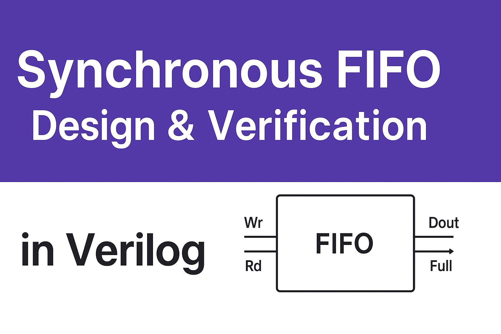

# 🗂️ Synchronous FIFO Design and Verification

## 📌 Project Overview

This repository contains the design and verification of a **Synchronous FIFO (First-In-First-Out) memory** using Verilog.
The FIFO is designed with parameterized depth and width, and verified through a comprehensive testbench to ensure correctness in various scenarios.

---

## ⚙️ Features

* Parameterized FIFO size (depth & width)
* Synchronous Read and Write operations
* Reset logic implementation
* FIFO Full and Empty flag handling
* Support for simultaneous Read & Write

---

## 🧪 Test Cases Verified

The FIFO design has been validated against the following scenarios:

* Normal Write & Read operations
* FIFO Full condition
* FIFO Empty condition
* Write when FIFO is full
* Read when FIFO is empty
* Simultaneous Read & Write
* Reset condition behavior

---

## 📂 Repository Structure

```
├── sync_fifo.v       # FIFO Design file  
├── sync_fifo_tb.v    # Testbench file  
└── README.md         # Project documentation  
```

## 📊 Sample Output

* FIFO operations
* Flag status (Full / Empty)
* Test case validation

---

## 🚀 Future Enhancements

* Asynchronous FIFO implementation
* Gray code pointer-based design
* Coverage-driven verification

---

## 🤝 Contributions

Contributions are welcome! Feel free to fork this repo and submit pull requests.

---

## 🔗 Connect with Me

* [LinkedIn](https://linkedin.com/in/rakesh-magapu-592b28221)
* Email: [rakeshmagapu5@gmail.com](mailto:rakeshmagapu5@gmail.com)
